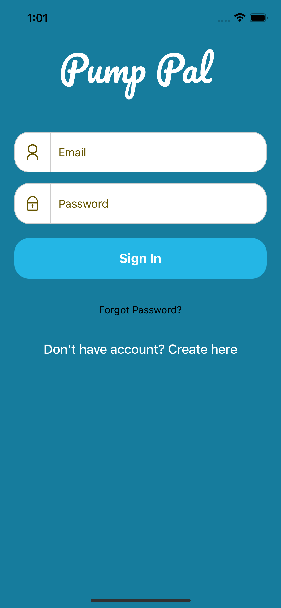
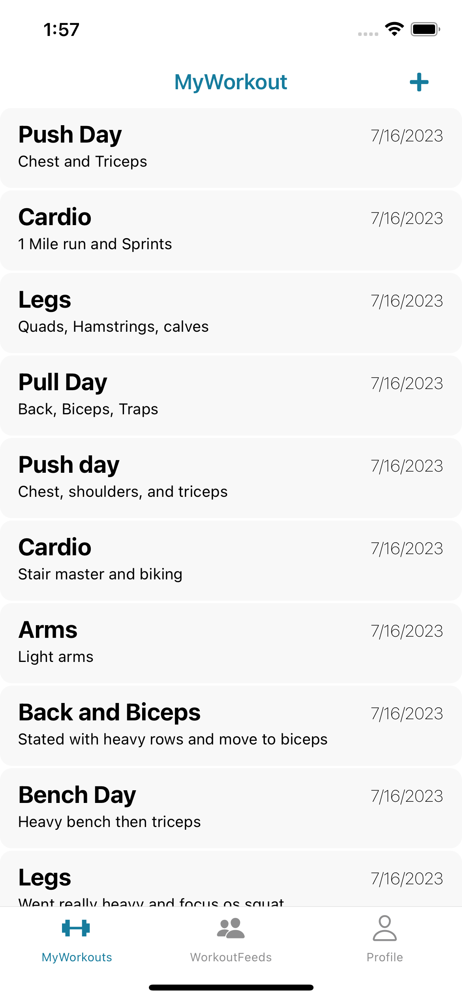
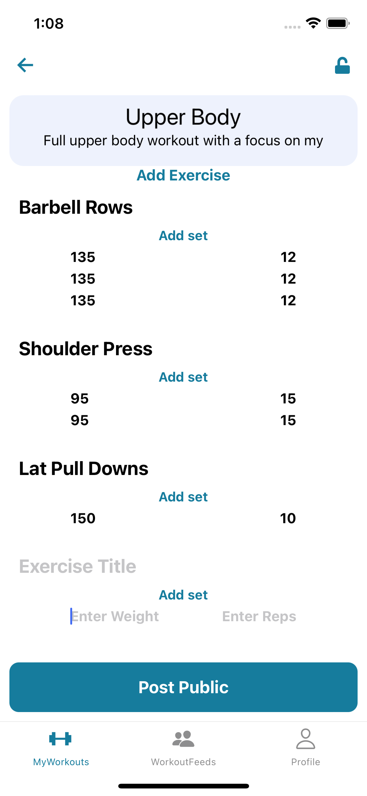
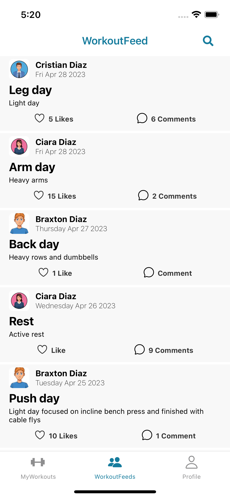
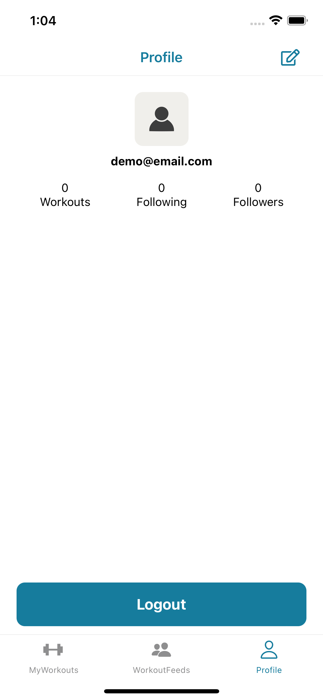
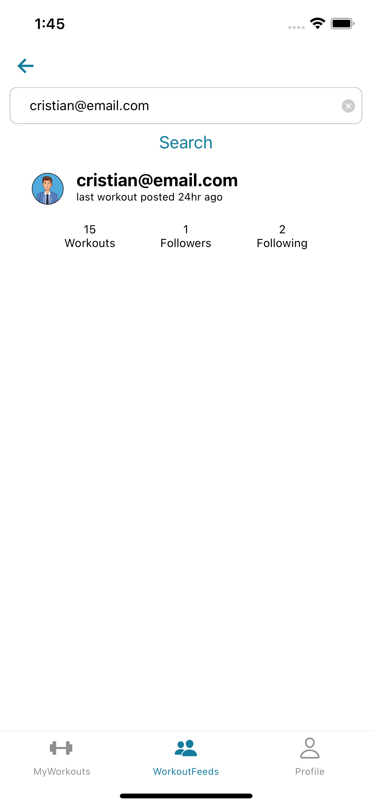

# Pump Pal

Welcome to Pump Pal, a React Native and Firebase-powered workout social media app! With this app, you can easily track your workouts, share them with the community, and stay motivated by following the fitness journeys of others. Seamlessly integrated with Firebase, you can post your workouts, engage with others by liking and commenting on their posts, and build a supportive fitness community. Whether you're a fitness enthusiast or just starting your journey, this app provides a platform to connect, inspire, and achieve your fitness goals together.

# Login & Registration

  
  

# My Workouts

# Posting Workouts

# Workout Feed

# Profile Page

# Search for Users

